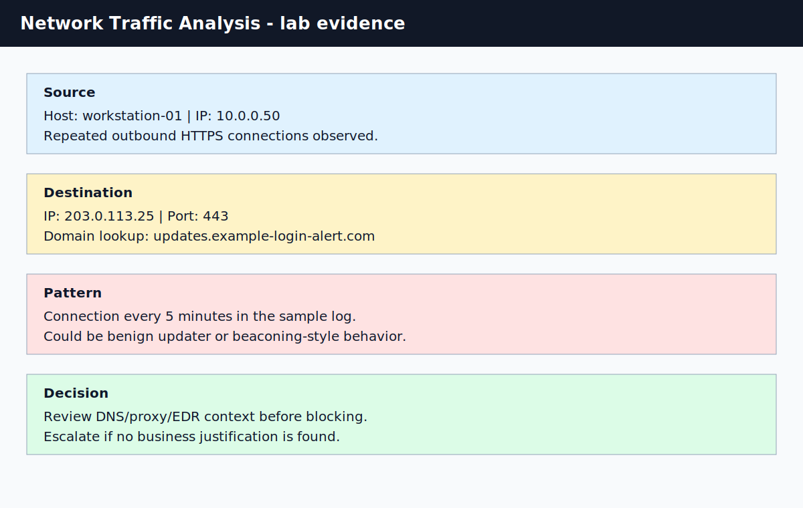

# Network Traffic Analysis Lab

## What I Practiced

I practiced reviewing repeated outbound network connections and documenting what I would check before deciding whether the traffic is benign or suspicious.

## Evidence

| Artifact | Purpose |
| --- | --- |
| [sample-zeek-conn.log](./sample-zeek-conn.log) | Sanitized Zeek-style connection log |
| [network-analysis-notes.md](./network-analysis-notes.md) | My assessment and next checks |
| [network-traffic-summary.svg](../../assets/screenshots/network-traffic-summary.svg) | Screenshot-style traffic summary |

## Scenario

An endpoint generates repeated outbound HTTPS connections to an unfamiliar external IP address. I reviewed source, destination, port, timing, and what additional context would be needed.

## Evidence Checklist

| Evidence | Why I Reviewed It |
| --- | --- |
| Source IP and hostname | Identifies the affected asset |
| Destination IP/domain | Identifies what the host contacted |
| Destination port | Helps infer protocol or service |
| Frequency and timing | Helps identify periodic behavior |
| DNS/proxy/EDR context | Helps separate benign updates from suspicious activity |
| Threat intelligence result | Adds external reputation context |

## My Assessment

The repeated five-minute timing is worth reviewing, but I would not block the destination based only on timing. I would first identify the process, DNS query, proxy URL, and whether the destination is related to expected software.

## Recommended Next Steps

1. Identify the endpoint process that created the connections.
2. Review DNS logs for the destination domain.
3. Check proxy/firewall logs for full URL and user-agent context.
4. Search reputation sources for the IP/domain.
5. Escalate if there is no business justification or if endpoint telemetry shows suspicious behavior.

## What I Learned

Network investigation is about context. Repetition can be suspicious, but process, DNS, proxy, and endpoint evidence are needed before making a confident decision.

## References

- Wireshark documentation: https://www.wireshark.org/docs/
- Zeek documentation: https://docs.zeek.org/
- MITRE ATT&CK Application Layer Protocol: https://attack.mitre.org/techniques/T1071/
