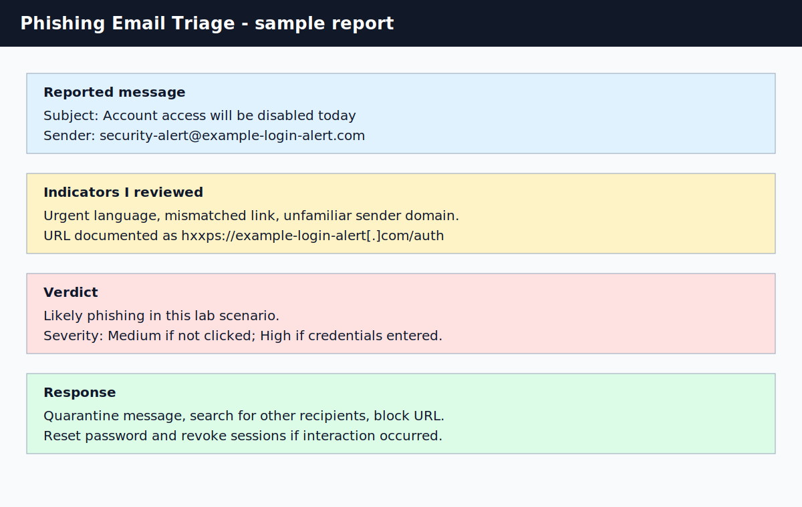

# Phishing Email Analysis Lab

## What I Practiced

I practiced triaging a suspicious email by reviewing sender details, authentication results, link behavior, social engineering indicators, and user impact.

## Evidence

| Artifact | Purpose |
| --- | --- |
| [sample-email.eml](./sample-email.eml) | Sanitized sample phishing email |
| [phishing-triage-report.md](./phishing-triage-report.md) | My triage notes, indicators, verdict, and response steps |
| [phishing-email-triage.svg](../../assets/screenshots/phishing-email-triage.svg) | Screenshot-style summary of the triage decision |

## Scenario

A user reports an email claiming that their account will be disabled unless they sign in immediately. The email contains a login-themed link to an unfamiliar domain.

## Triage Checklist

| Check | What I Looked For | Why It Matters |
| --- | --- | --- |
| Sender address | Strange or lookalike domain | Attackers often impersonate trusted services |
| Reply-To | Different or suspicious reply path | May reveal attacker-controlled inbox |
| Subject and tone | Urgency, fear, account closure | Common social engineering pattern |
| Links | Mismatched or unfamiliar destination | May lead to credential harvesting |
| Headers | SPF, DKIM, DMARC results | Helps validate sender authenticity |
| User interaction | Clicked, opened, submitted credentials | Determines response urgency |

## My Decision

I would treat the sample message as likely phishing because it combines urgency, failed authentication checks, and a login link to an unfamiliar domain.

## Response I Would Take

1. Quarantine the message if still present.
2. Search mailboxes for the same sender, subject, and URL.
3. Ask the user whether they clicked the link or entered credentials.
4. Block the URL/domain if confirmed malicious.
5. Reset credentials and revoke sessions if interaction occurred.

## What I Learned

A phishing decision is stronger when I document multiple indicators instead of relying on one clue. Sender, authentication results, URL, tone, and user interaction all matter.

## References

- CISA phishing guidance: https://www.cisa.gov/news-events/news/avoiding-social-engineering-and-phishing-attacks
- MITRE ATT&CK Phishing: https://attack.mitre.org/techniques/T1566/
