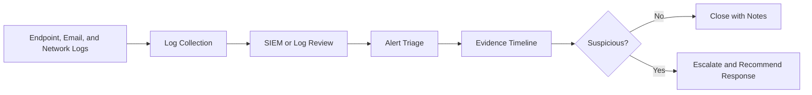

# SOC Home Lab

## What I Practiced

I practiced a SOC analyst workflow: receive an alert, review evidence, identify affected users and hosts, build a timeline, map likely behavior to MITRE ATT&CK, decide whether to escalate, and document response recommendations.

## Lab Architecture

## SOC Case Studies

| Case Study | Scenario | Skills Demonstrated |
| --- | --- | --- |
| [Failed Logons Followed by Successful Authentication](./case-studies/credential-attack-incident-report.md) | Repeated Windows failed logons followed by successful access | Windows Event ID review, authentication timeline, MITRE mapping, response recommendations |
| [Suspicious PowerShell Activity](./case-studies/suspicious-powershell-activity-incident-report.md) | Office process launches PowerShell with suspicious behavior | Process tree review, command-line analysis, Sigma-style logic, KQL idea, endpoint triage |
| [Phishing Credential Harvesting Link](./case-studies/phishing-credential-harvest-incident-report.md) | User reports urgent login-themed email | Email triage, URL defanging, user impact review, containment planning |
| [Unusual Outbound Network Activity](./case-studies/unusual-outbound-network-activity-incident-report.md) | Workstation repeatedly contacts rare external destination | Zeek-style log review, DNS/proxy context, beaconing analysis, response planning |

## Evidence Used

| Artifact | Purpose |
| --- | --- |
| [Windows sample events](../windows-event-log-analysis/sample-windows-security-events.csv) | Authentication timeline evidence |
| [Windows timeline image](../../assets/screenshots/windows-event-log-timeline.svg) | Visual timeline of failed and successful logons |
| [Python tool output](../../tools/python-log-triage/output/sample-output.txt) | Script output from sample authentication events |
| [Sample phishing email](../phishing-email-analysis/sample-email.eml) | Email triage practice evidence |
| [Sample Zeek connection log](../network-traffic-analysis/sample-zeek-conn.log) | Network traffic investigation evidence |

## My Workflow

1. Review alert name, severity, source, destination, user, and timestamp.
2. Identify affected user, host, source IP, and relevant log source.
3. Gather related events before and after the alert.
4. Build a short evidence timeline.
5. Validate whether the source, process, or user action is expected.
6. Map suspicious behavior to MITRE ATT&CK where relevant.
7. Document findings, false-positive considerations, and response recommendations.

## What I Learned

Good SOC work is not only finding a suspicious event. It is explaining why the event matters, what evidence supports the decision, what still needs validation, and what action should happen next.

## References

- MITRE ATT&CK: https://attack.mitre.org/
- NIST Computer Security Incident Handling Guide: https://csrc.nist.gov/publications/detail/sp/800-61/rev-2/final