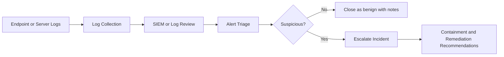

# SOC Home Lab

## Executive Summary

This project documents a practical SOC analyst workflow for monitoring, triaging, and escalating suspicious activity in a lab environment. The purpose is to demonstrate how alerts are reviewed, mapped to risk, documented, and communicated.

## Problem Statement

Entry-level SOC analysts need to understand how logs become alerts, how alerts become investigations, and how investigations become clear recommendations. This lab provides a structured workflow for that process.

## Objectives

- Define a simple security monitoring workflow.
- Document alert triage steps.
- Map suspicious activity to MITRE ATT&CK tactics and techniques.
- Produce an incident note that is clear enough for handoff.
- Identify false-positive considerations and next actions.

## Lab Architecture

## Tools and Concepts

| Category | Examples |
| --- | --- |
| SIEM concepts | Alert queues, dashboards, search queries |
| Endpoint logs | Windows Security logs, Linux auth logs |
| Threat mapping | MITRE ATT&CK initial access, credential access, discovery |
| Documentation | Incident notes, executive summary, technical summary |

## Analyst Workflow

1. Review alert title, severity, source, destination, and timestamp.
2. Identify the affected user, host, and asset criticality.
3. Gather related logs before and after the alert time.
4. Check for failed logins, unusual process activity, or suspicious network connections.
5. Map observed behavior to a likely tactic or technique.
6. Decide whether to close, monitor, or escalate.
7. Document findings and recommended response steps.

## Sample Incident Note

| Field | Example |
| --- | --- |
| Alert | Multiple failed logins followed by successful authentication |
| Severity | Medium |
| Affected Asset | Workstation or server under investigation |
| Evidence | Failed login pattern, successful login, unusual source IP |
| MITRE ATT&CK | Credential Access / Valid Accounts |
| Recommendation | Validate user activity, reset password if unauthorized, review MFA status |

## Findings

- Repeated failed logins can indicate password guessing, stale credentials, or user error.
- Successful authentication after failed attempts should be reviewed with user and source context.
- Escalation quality improves when notes include timestamps, hosts, users, evidence, and reasoning.

## Lessons Learned

- Alert severity alone is not enough; context determines risk.
- Clear notes matter as much as technical investigation.
- A repeatable workflow reduces missed evidence during triage.

## Future Improvements

- Add screenshots from a SIEM dashboard.
- Add sample Windows and Linux logs.
- Add detection queries for Splunk, Wazuh, and Microsoft Sentinel.
- Add a complete incident report template.

## References

- MITRE ATT&CK: https://attack.mitre.org/
- NIST Computer Security Incident Handling Guide: https://csrc.nist.gov/publications/detail/sp/800-61/rev-2/final