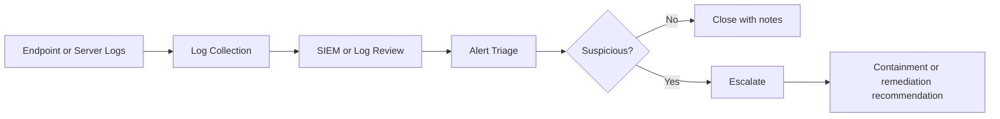

# SOC Home Lab

## What I Practiced

I practiced a basic SOC workflow: receive an alert, review the available evidence, decide what additional context is needed, document the investigation, and recommend next steps.

## Lab Architecture

## Evidence Used

| Artifact | Purpose |
| --- | --- |
| [Credential attack case study](./case-studies/credential-attack-incident-report.md) | Full investigation writeup |
| [Windows sample events](../windows-event-log-analysis/sample-windows-security-events.csv) | Authentication timeline evidence |
| [Windows timeline image](../../assets/screenshots/windows-event-log-timeline.svg) | Visual timeline of the alert |
| [Python tool output](../../tools/python-log-triage/output/sample-output.txt) | Script output from sample authentication events |

## My Workflow

1. I reviewed the alert name, severity, source, destination, user, and timestamp.
2. I identified the affected user, host, and source IP.
3. I gathered related events before and after the alert time.
4. I checked for failed logins followed by successful authentication.
5. I mapped the behavior to likely MITRE ATT&CK techniques.
6. I decided what I would validate next before containment.
7. I documented findings in a clear handoff format.

## Sample Alert Note

| Field | Value |
| --- | --- |
| Alert | Multiple failed logons followed by successful authentication |
| Severity | Medium in this lab |
| Affected user | `alice` |
| Source IP | `10.0.0.50` |
| Destination host | `workstation-01` |
| Evidence | Three failed logons followed by one successful logon |
| Recommendation | Validate source host ownership, check MFA, review privileged events |

## What I Learned

Alert severity alone is not enough. I need context: user behavior, source ownership, logon type, follow-on activity, and whether the same source targeted other accounts.

## References

- MITRE ATT&CK: https://attack.mitre.org/
- NIST Computer Security Incident Handling Guide: https://csrc.nist.gov/publications/detail/sp/800-61/rev-2/final
