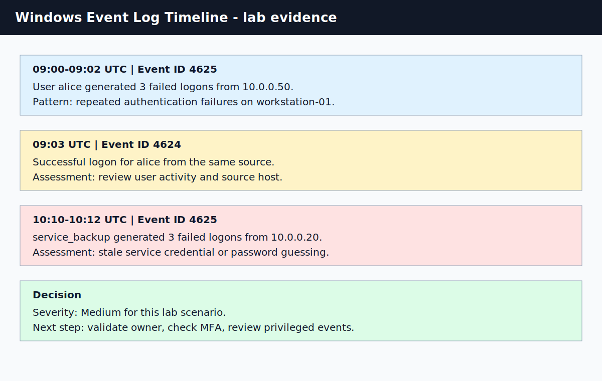

# Windows Event Log Analysis

## What I Practiced

I practiced reviewing Windows Security authentication events and turning raw log rows into an investigation timeline. The lab focuses on Event ID `4625` failed logons and Event ID `4624` successful logons.

## Evidence

| Artifact | Purpose |
| --- | --- |
| [sample-windows-security-events.csv](./sample-windows-security-events.csv) | Sanitized Windows authentication events used for the lab |
| [investigation-notes.md](./investigation-notes.md) | My timeline, assessment, and next checks |
| [windows-event-log-timeline.svg](../../assets/screenshots/windows-event-log-timeline.svg) | Screenshot-style summary of the investigation timeline |

## Objectives

- Review common Windows Security Event IDs.
- Identify suspicious login behavior.
- Build a clear timeline from sample events.
- Explain what I would check next before deciding severity.

## Key Event IDs

| Event ID | Meaning | How I Used It |
| --- | --- | --- |
| 4624 | Successful logon | Confirmed that access occurred after failures |
| 4625 | Failed logon | Identified repeated failed authentication attempts |
| 4672 | Special privileges assigned | A follow-up check if suspicious authentication succeeds |
| 4720 | User account created | A follow-up check for unexpected account creation |
| 4728 | Member added to privileged group | A follow-up check for privilege escalation |

## Investigation Workflow

1. I filtered events around the alert timestamp.
2. I grouped activity by user, source IP, host, and event ID.
3. I compared failed and successful logon patterns.
4. I checked whether the same source produced repeated failures.
5. I identified what context would be needed next: source ownership, MFA, logon type, and privileged activity.
6. I documented the timeline and my assessment.

## Findings

| Finding | Assessment | Next Step |
| --- | --- | --- |
| `alice` had three failures followed by a success | Medium concern in this lab | Validate whether source host is expected |
| `service_backup` had repeated failures | Could be stale credential or guessing | Check service ownership and recent password changes |
| No privileged event is included in sample data | Severity stays medium unless more evidence appears | Search for Event ID 4672 and group changes |

## What I Learned

A failed logon is not enough by itself. The useful signal comes from the pattern: repeated failures, a successful login, source context, logon type, and what happened after access was granted.

## References

- Microsoft Security Auditing Events: https://learn.microsoft.com/windows/security/threat-protection/auditing/security-auditing-overview
- MITRE ATT&CK Valid Accounts: https://attack.mitre.org/techniques/T1078/
