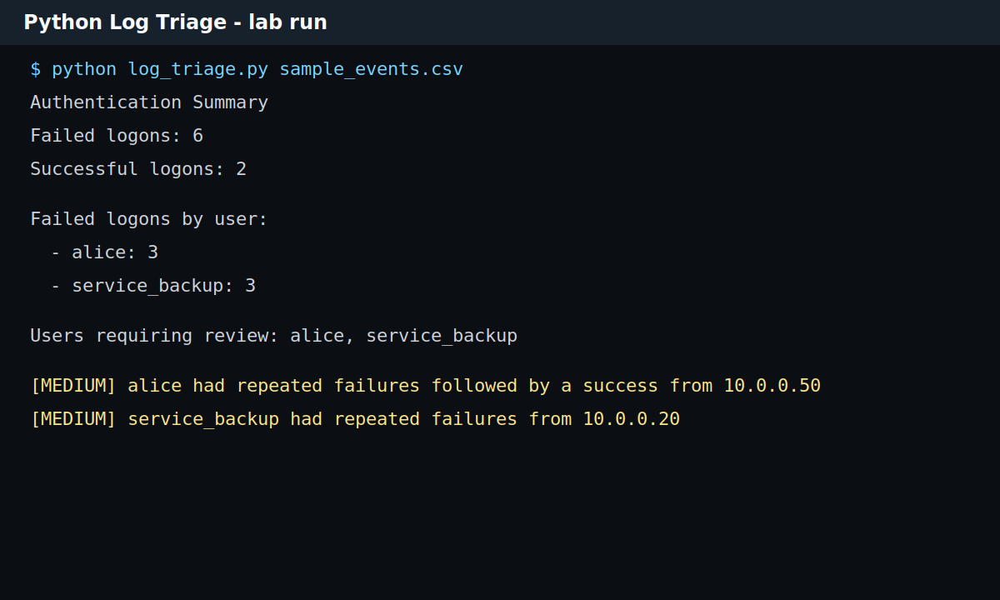

# Python Log Triage Tool

## What I Built

I built a small Python script that reads authentication events from a CSV file and summarizes failed logons, successful logons, and users that need review.



## Evidence

| Artifact | Purpose |
| --- | --- |
| [log_triage.py](./log_triage.py) | Python script for CSV log triage |
| [sample_events.csv](./sample_events.csv) | Sanitized authentication event data |
| [output/sample-output.txt](./output/sample-output.txt) | Captured output from the sample run |
| [python-log-triage-output.svg](../../assets/screenshots/python-log-triage-output.svg) | Screenshot-style output image |

## Usage

```bash
python log_triage.py sample_events.csv
```

## Sample Output

```text
Authentication Summary
Failed logons: 6
Successful logons: 2

Failed logons by user:
- alice: 3
- service_backup: 3

Users requiring review: alice, service_backup
```

## Why I Made It

Manual log review can become repetitive. This script gives me a simple way to practice turning raw event rows into a short analyst summary.

## What I Practiced

- Reading structured CSV data with Python.
- Counting failed and successful authentication events.
- Grouping failures by user.
- Producing readable investigation output.
- Connecting script output to a SOC-style triage decision.

## Improvements I Want To Add

- Add source IP frequency analysis.
- Detect failed logons followed by success automatically.
- Export a Markdown incident note.
- Add JSON input support.
